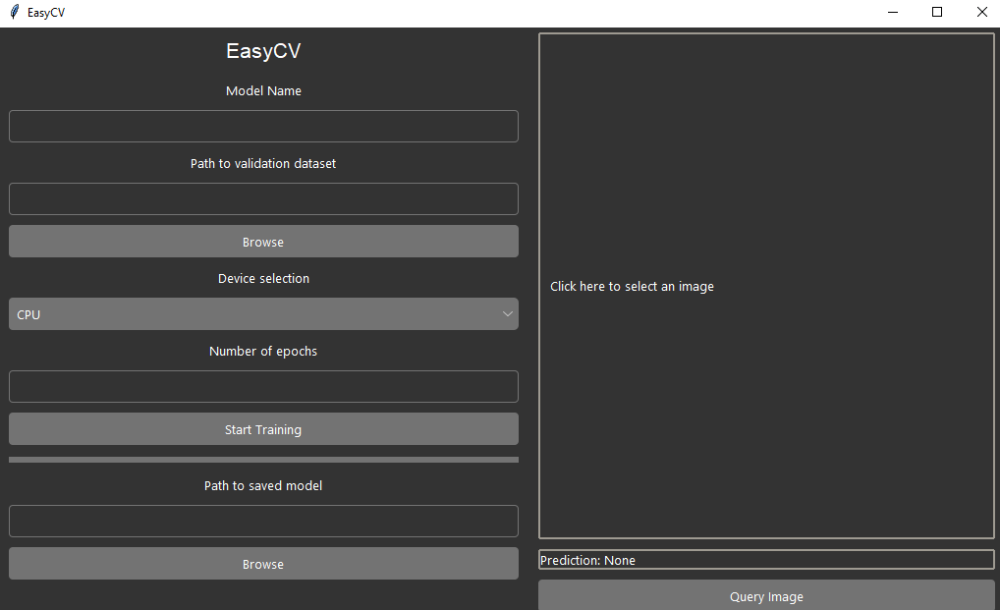

# EasyCV: Python GUI for image identification training

## What is it?
A simple GUI created in Tkinter that allows the user to train image identification models with zero code.
The approach taken to training is a pretty standard PyTorch approach.
I completed this project as a sort of introduction to PyTorch.

## How to use?
Select a folder containing your train and/or eval image data, set your desired devices and epoch count, and go!
Additionally, you can query prexisting models in the PyTorch .pth format.

### Requirements
A Nvidia GPU or a sufficiently powerful CPU is required
All the standard libraries for development in PyTorch are required

## Bugs
- MultiThreading with Tkinter is weird, can result in lag and errors
- requires a very precise file structure, damaging the original intent of being incredibly simple